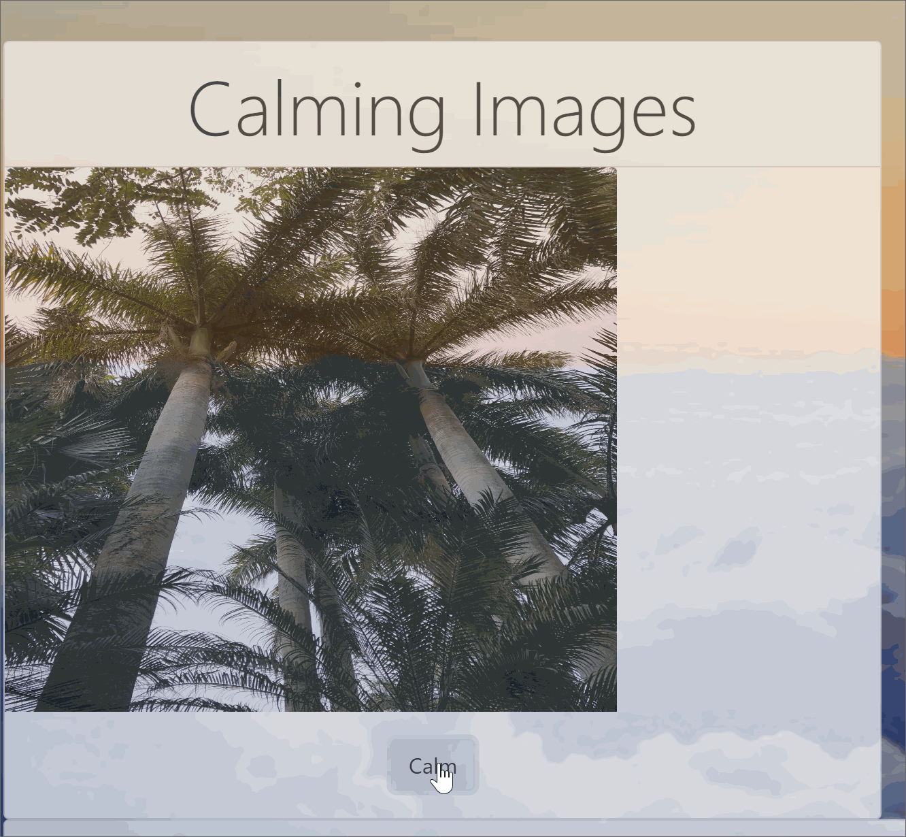
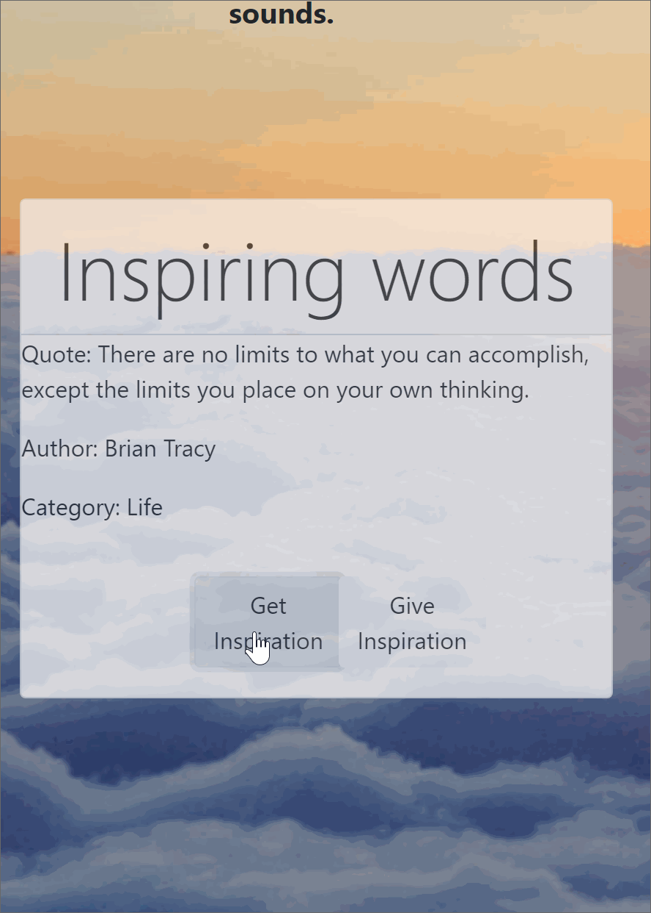
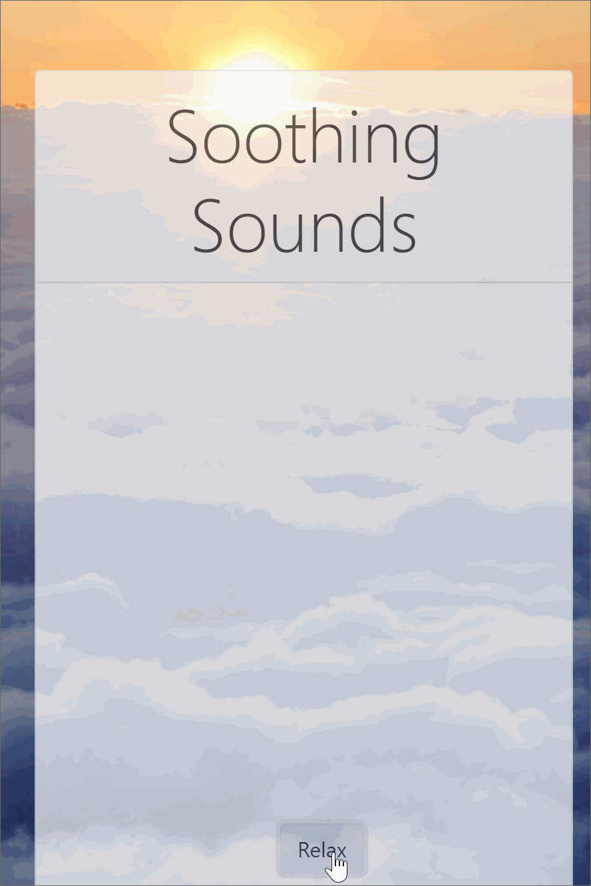

# Welcome to The Great Stress Escape! 

Vistit the site at: https://thegreatstressescape.herokuapp.com/

We created this web page to give people break when when they cannot get away from the stressful situation that they're in (or their computer). Like any web page, users can spend as much time on it as they would like. However, our intent was to provide a site where users can spend just a few minutes, if not less, for emergency attitude adjustment.

## Calming Images

Clicking the “Calm” button will display randomly generated, relaxing images. These images have been submitted by the creators of this web page. They call themselves the Fabulous Five.

## Inspiring Words

Clicking the “Get Inspiration” button will display random quotes from the npm iQuotes package. Clicking “Give Inspiration” button will display quotes submitted by users.

## Soothing Sounds

Clicking the “Relax” button will cycle through the Spotify API and provide users with a mixture of comedy channels, soothing music, and nature sounds. Users can click the "Relax" button again if the current displayed selection is not to their liking.

For this project we used:

* Bootstrap and Handlebars
* Node and Express Server
* MySQL and Sequelize
* GET and POST routes
* Requests of existing data and sending new data to the database

Team Members:
* Ben Zamora
* Jason Violet
* Lynn Amsbury
* Sara Overby
* Zoe Gonzales